# MultiVac

A single-page BigQuery SQL IDE with query lineage visualization and a built-in analysis notebook — one FastAPI backend, one self-contained HTML frontend, zero build step. Works against BigQuery **or** local data files (CSV/Excel/Parquet/JSON).

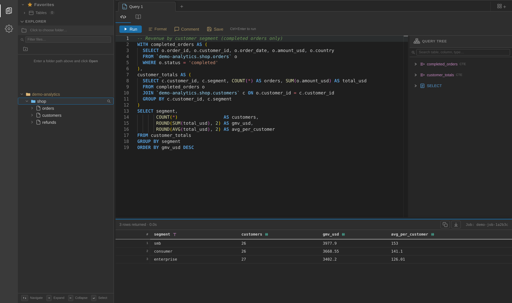

## Quick start

### 1. Install & run

```bash
gcloud auth application-default login        # ADC — no API keys in code
cp backend/.env.example backend/.env         # set BQ_DEFAULT_PROJECT
make install
make dev                                     # http://localhost:8000
```

### 2. First query (BigQuery)

1. The sidebar loads your GCP projects on boot — expand a project → dataset → table (columns load on expand). Star tables you use often under **Favorites**.
2. Click a table to insert a SQL snippet into the editor, or just write SQL. `Ctrl+Enter` (`Cmd+Enter` on Mac) runs it; results appear in the bottom grid with type icons, filters, copy and CSV download.
3. As you type, the **Query Tree** panel on the right parses your SQL live into CTEs → sources → final SELECT, with join keys and column chips. Click ▶ on any CTE or source to preview it in its own tab — no need to run the full query to debug one step.
4. Everything (tabs, SQL, story blocks) is auto-saved to a session file and restored on next launch.

### 3. Working with data files (no BigQuery needed)

1. In the sidebar **Explorer**, choose a local folder.
2. Double-click any `.csv`, `.tsv`, `.xlsx`, `.parquet`, `.json`/`.jsonl` file — it opens as a data workspace with a sortable/filterable **Data Table** view.
3. The file is loaded as a DataFrame (`df`). Open the **Story** tab and every analysis block below works on it exactly like on a query result. SQL also works — a local Polars SQL engine queries `df` directly, no warehouse round-trip, no cost.
4. Excel files load all sheets; each sheet is addressable as its own table in blocks and local SQL.

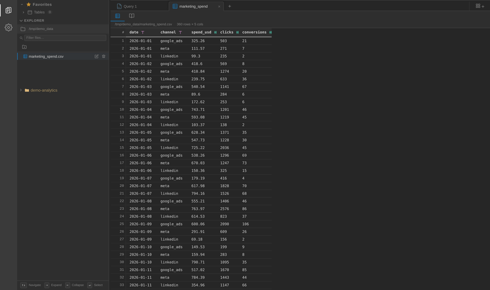

## Query Tree — debug SQL step by step

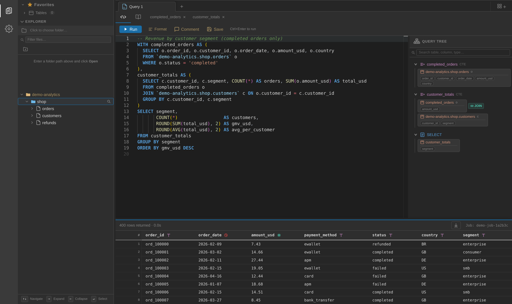

The right-hand panel is a live structural view of the editor SQL: every CTE, source table, and the final SELECT, with the columns each node exposes and the join keys that connect them. Preview a node (▶) and MultiVac reconstructs only the SQL needed for that node (`WITH dep AS (...) SELECT * FROM node LIMIT 100`), runs it, and feeds real BigQuery column types back into the tree.

## Story — the analysis notebook

Run a query (or open a data file), switch to the **Story** tab, and stack blocks from the toolbar. Each block re-runs against the current result with ▶. Blocks can be reordered, commented, exported as images, and the whole story exported as a document.

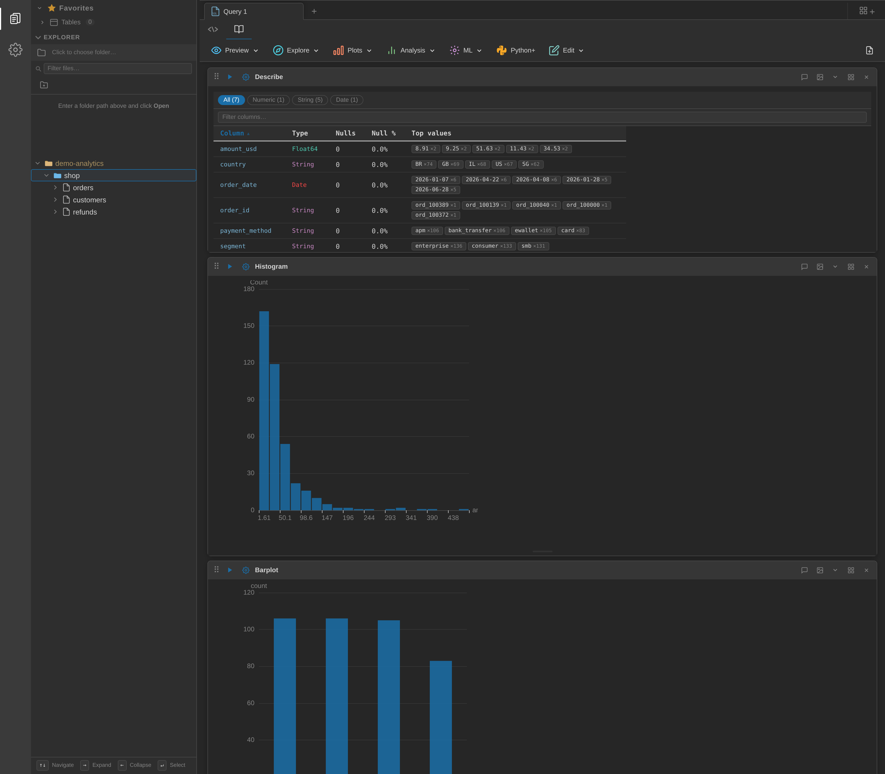

### Preview & Explore

| Block | What it does | When to use |
|---|---|---|
| **Shape** | Row × column count | Sanity check after joins/filters |
| **Preview** | Head / tail / random sample, column subset | Eyeball the data |
| **Describe** | Per-column type, null count, null %, top values — filterable by Numeric/String/Date | First look at any new table; instantly spots empty or skewed columns |
| **Value Count** | Frequency table with % bars for one column | Categorical distributions (payment methods, statuses, countries) |
| **Search** | Type-aware filters per column (numeric ranges, date ranges, string contains) | Drill into specific rows without rewriting SQL |
| **Query result** | Run SQL on the result itself (local Polars engine) | Re-aggregate or reshape without another BigQuery job |

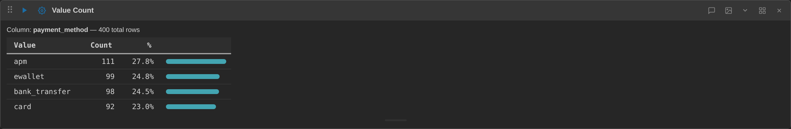

### Plots

Histogram (with bin control), Scatter, Line, Box Plot, and Barplot (count/sum/mean aggregation, grouping, orientation). All rendered with ECharts and exportable as images.

### Analysis (statistics)

| Block | What it does | Output |
|---|---|---|
| **Column Describe** | Deep-dive on one column: quantiles, std, skew ("bias"), distribution histogram, IQR whiskers | Full univariate profile |
| **Outlier Detect** | Flags outliers by IQR, Z-Score, Modified-Z, or Percentile with adjustable threshold | Outlier count, bounds, and flagged rows — great before aggregating amounts |
| **Lin. Regression** | Fits X→Y with 95% CI band, optional per-group fits (up to 20 groups) | R², r, p-value, slope/intercept — and a one-click button that appends the prediction as a new column |
| **Hypo. Test** | Compares a numeric value across groups: auto-picks t-test (2 groups) or ANOVA (3+), also Mann-Whitney / Kruskal | Test statistic, p-value, significance verdict, effect size, per-group stats, jitter + density plots |
| **Corr. Matrix** | Pairwise correlation heatmap over all (or selected) numeric columns, r/r² table sorted by strength, optional scatter mode | Fast collinearity / driver scan |

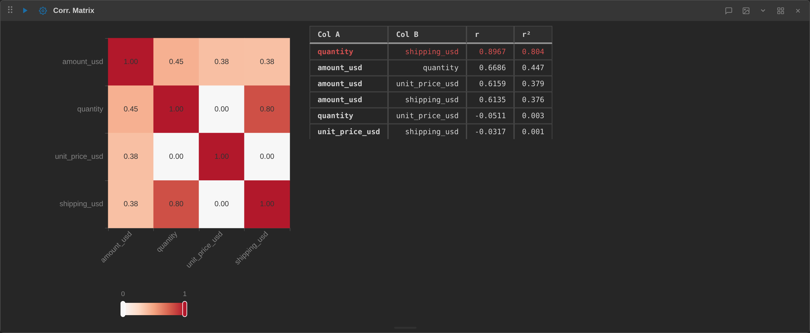

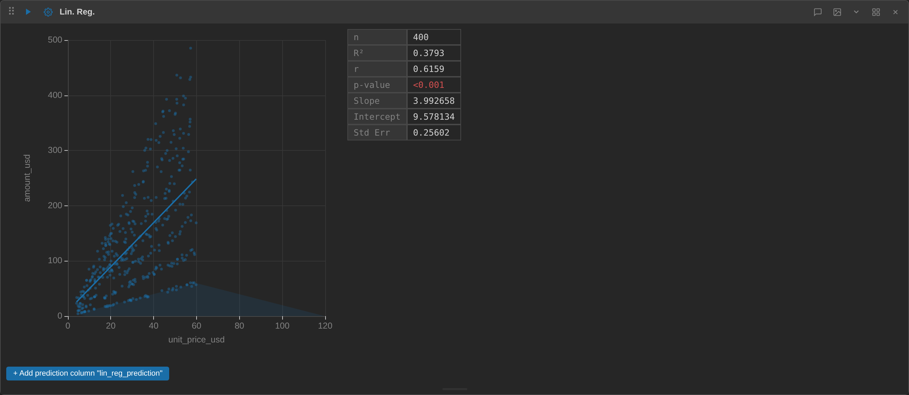

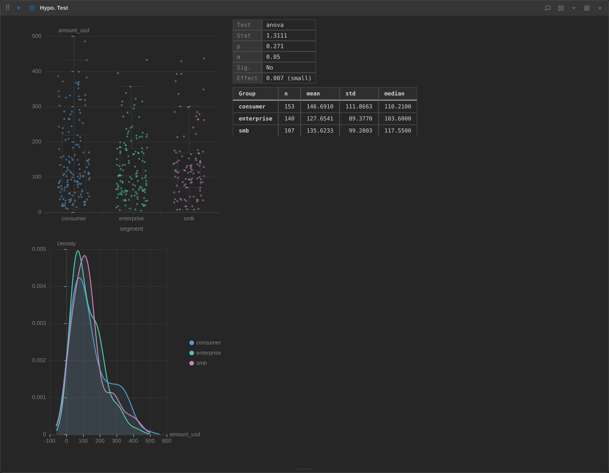

### ML

| Block | What it does |
|---|---|
| **Data Split** | Train/test split (adjustable %, seed, optional stratify) — adds a `split` label used by Predict Model |
| **Feature Importance** | Trains decision tree / random forest / XGBoost / linear model on a target and ranks features; auto-detects regression vs classification; categorical features are label-encoded automatically |
| **Predict Model** | Trains and evaluates a model (optionally honoring the `split` column), reports metrics and predictions |

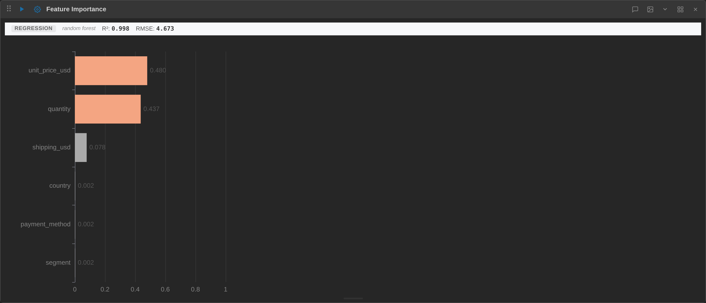

Tip: exclude ID and date columns from features (use the Features (X) picker) — high-cardinality identifiers pollute importances.

### Python blocks

**Python+** adds a free-form Python block executed server-side with the result available as a DataFrame — for anything the built-in blocks don't cover.

Blocks work identically on file data:

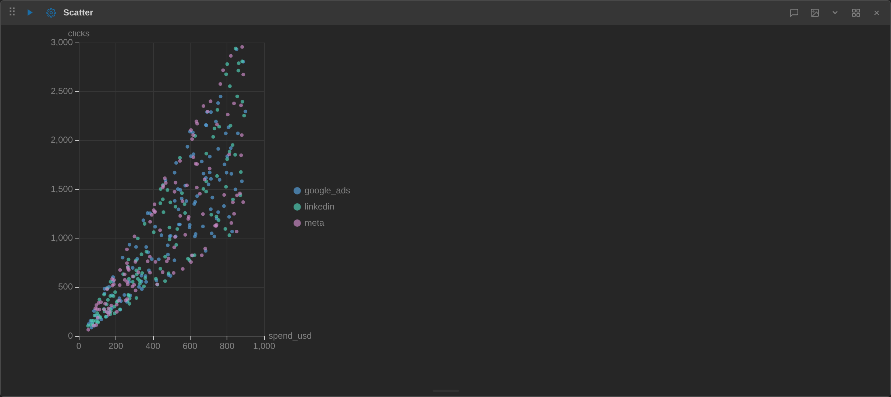

## Themes

Dark (default), light, and several fun ones (claude, 1984, matrix, vscode) — in Preferences (gear icon), persisted per browser.

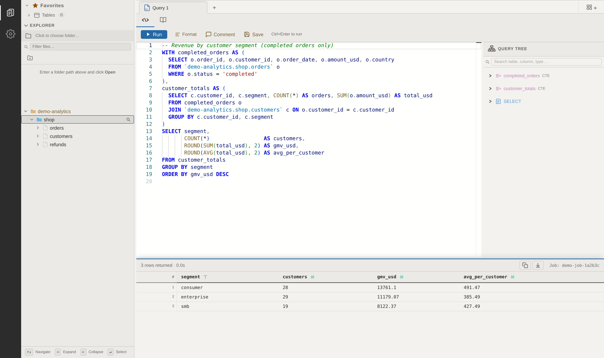

## Architecture

```
backend/
  main.py            # FastAPI: BQ proxy, story-block engine, python exec, file API
  static/index.html  # the entire frontend (self-contained, no bundler)
  static/vs/         # vendored Monaco editor
Dockerfile           # Cloud Run image
Makefile             # dev / install / build / deploy
```

- Auth via Google **Application Default Credentials** — no keys in code
- All BQ calls run through `asyncio.to_thread`; non-JSON BQ types (datetime, Decimal, bytes) are normalized
- Local engine: Polars (`SQLContext` for SQL, DataFrames for blocks); stats via SciPy, ML via scikit-learn/XGBoost
- `frontend/` is an unused React+Vite prototype — ignore it

### API (main routes)

| Route | Purpose |
|---|---|
| `GET /api/projects` / `.../datasets` / `.../tables` | Explorer tree |
| `GET /api/projects/{p}/tables/search` | Table search across datasets |
| `GET /api/tables/{p}/{d}/{t}/schema` | Table schema |
| `POST /api/query` | Run SQL on BigQuery |
| `POST /api/query/local` | Run SQL locally on a result set (Polars) |
| `POST /api/story/block` | Run an analysis block |
| `POST /api/python/exec` | Run a Python block |
| `POST /api/fs/*` | Local file workspace operations |
| `POST /api/session/save` / `GET /api/session/load` | Session persistence |

### Environment variables

| Variable | Default | Description |
|---|---|---|
| `BQ_DEFAULT_PROJECT` | — | Default GCP project for queries |
| `QUERY_MAX_ROWS` | `1000` | Row cap on query results |
| `PORT` / `HOST` | `8080` / `0.0.0.0` | Docker/Cloud Run only |

## Deploy (Cloud Run)

```bash
make build                                   # docker build
make deploy                                  # gcloud run deploy
make deploy SERVICE=multivac REGION=europe-west1 PROJECT=my-project   # overrides
```

## Notes

- Stopping a query aborts the browser fetch only — the BigQuery job keeps running server-side
- All screenshots use synthetic demo data
